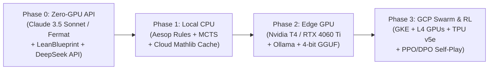
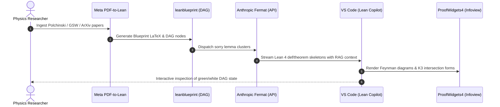
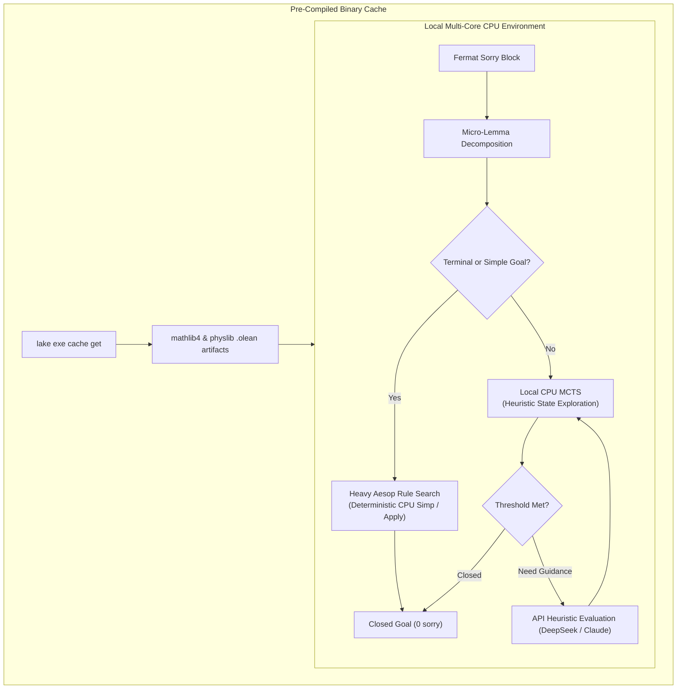
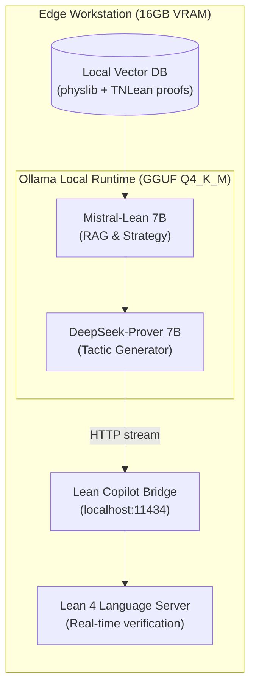
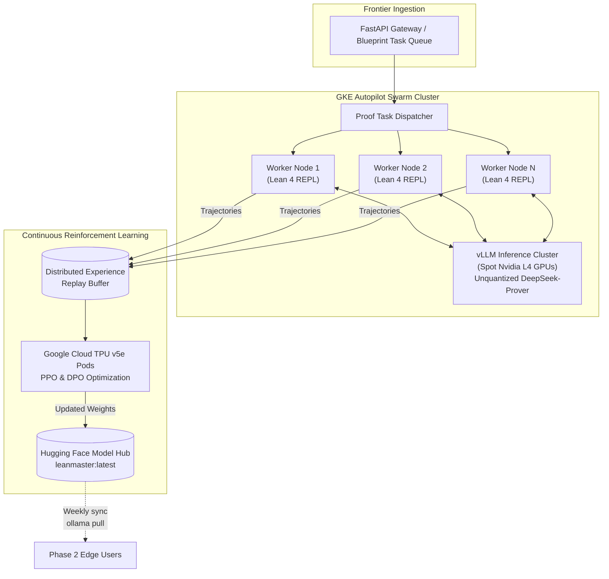
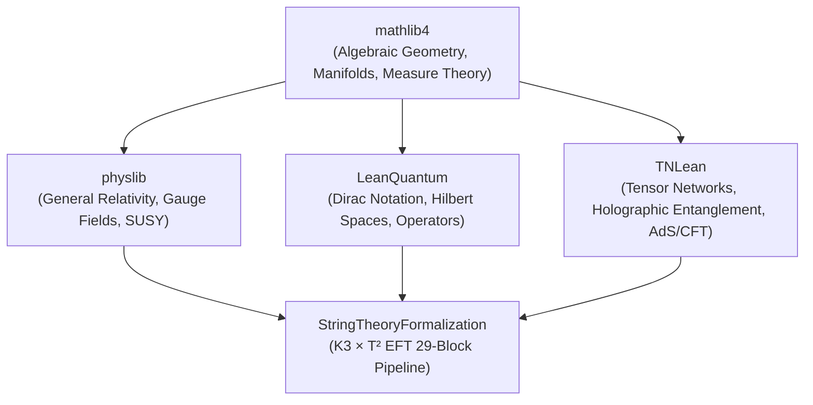

# LeanMaster Extended Architecture: Phased Deployment Roadmap

> **Bridging Unstructured Physics Literature and Mechanized Lean 4 Proofs**  
> *From "Zero-GPU" API-Driven Blueprints to a Global GCP TPU Swarm for String Theory and M-Theory Formalization*

---

## Executive Summary

The **LeanMaster Extended Architecture** bridges the gap between unstructured theoretical physics literature (PDFs, ArXiv preprints, textbooks) and machine-verified, zero-axiom proofs mechanized in **Lean 4**.

Formalizing frontier string theory—specifically Calabi-Yau moduli spaces, $K3 \times T^2$ compactifications, flux superpotentials, and Swampland conjectures—presents distinct computational hurdles:
1. **Semantic gap**: Informal physics arguments frequently elide rigorous functional analysis, contour integrals, and intersection homologies.
2. **Search complexity**: Combinatorial explosion in state-space tactic exploration.
3. **Compute disparity**: Transitioning seamlessly from local development (laptops, edge workstations) to massive cloud reinforcement learning swarms.

To overcome these barriers, LeanMaster implements a **four-phase evolutionary roadmap (Phases 0 through 3)** that scales proof generation capacity with available hardware.



---

## Core Technology Stack

| Layer | System / Component | Primary Function | Deployment Target |
|---|---|---|---|
| **Ingestion** | **Meta PDF-to-Lean** (VLM / HyperTree) | Parses LaTeX, ArXiv preprints, and diagrams into preliminary Lean 4 definitions, theorems, and DAG blueprint nodes. | Cloud / API |
| **High-Level Strategist** | **Anthropic Fermat** (API) / **Mistral-Lean** (7B / 8x7B MoE) | Mathematical architect performing RAG over verified blocks, structuring macroscopic lemma skeletons with safe `sorry` boundaries. | Claude 3.5 Sonnet API / Ollama |
| **Micro-Tactic Solver** | **DeepSeek-Prover** (DeepSeekMath / Prover family) | Generates fine-grained tactical sequences (`rw`, `simp`, `ring`, `linear_combination`) to eliminate individual `sorry` goals. | vLLM / Ollama (Q4_K_M) |
| **Symbolic Search Engine** | **Aesop** (*Automated Extensible Search for Obvious Proofs*) | White-box, deterministic tree search engine closing canonical goals locally without LLM inference overhead. | Native Lean 4 CPU |
| **Orchestration & Visuals** | **`leanblueprint`** + **`ProofWidgets4`** | Interactive web-based DAG visualization (green/white status) and interactive VS Code Infoview widgets (Feynman diagrams, tensor networks). | Web / VS Code |
| **Domain Libraries** | `mathlib4`, `physlib`, `TNLean`, `LeanQuantum` | Standardized mathematical and physical foundations (symplectic geometry, spin networks, AdS/CFT tensor networks). | Lean 4 Lake Ecosystem |

---

## Phased Deployment Strategy

```mermaid
timeline
    title LeanMaster Deployment Horizon
    section Phase 0 : Zero-GPU API
      Meta PDF-to-Lean Ingestion : Blueprint DAG Creation (Tao Method)
      Anthropic Fermat Strategy : Lean Copilot API streaming
      ProofWidgets4 visualization : Zero local GPU compute
    section Phase 1 : Local CPU Search
      Heavy Aesop rule sets : Local MCTS tree exploration
      Pre-compiled mathlib cache : Binary asset acceleration
    section Phase 2 : Edge Computing
      GGUF Q4_K_M quantization : Mistral-Lean 7B local RAG
      DeepSeek-Prover via Ollama : Offline VS Code Copilot loop
    section Phase 3 : GCP Swarm & RL
      GKE Autopilot Spot L4 : TPU v5e continuous PPO/DPO training
      Distributed Lean 4 REPL : Weekly HuggingFace model synchronization
```

---

### Phase 0: "Zero-GPU" API-Driven Orchestration & Blueprints

> **Objective:** Establish the complete end-to-end formalization pipeline on standard laptops without requiring local GPU compute, shifting heavy reasoning to cloud APIs.



#### Workflow
1. **Ingestion (Meta PDF-to-Lean):** Extracts definitions, lemmas, and heuristic proofs from classic literature (e.g., Polchinski, Green-Schwarz-Witten, Gukov-Vafa-Witten) and converts them into standardized LaTeX/Markdown specifications.
2. **Orchestration (The "Tao Method"):** Implements [`PatrickMassot/leanblueprint`](https://github.com/PatrickMassot/leanblueprint) to compile specifications into an interactive web-based DAG. Proof nodes are color-coded in real time:
   - 🟢 **Green:** Verified by Lean 4 kernel with 0 `sorry` axioms.
   - ⚪ **White:** Stated with `sorry` placeholders ready for agent assignment.
   - 🔵 **Blue:** Mathematical definitions and axiomatic assumptions.
3. **High-Level Strategy (Anthropic Fermat):** Connects Claude 3.5 Sonnet as the high-level architect agent via API. Fermat performs Retrieval-Augmented Generation (RAG) across our verified blocks, decomposes complex string calculations into lemma trees, and outputs structured files with localized `sorry` goals.
4. **Micro-Tactics (Lean Copilot API):** Integrates [`lean-dojo/LeanCopilot`](https://github.com/lean-dojo/LeanCopilot) inside VS Code configured as an `ExternalGenerator`. When developers or agents request `suggest_tactics`, Lean Copilot pings external LLM endpoints (DeepSeek API or Claude API) to propose tactics.
5. **Visual Proofs (ProofWidgets4):** Embeds [`ProofWidgets4`](https://github.com/leanprover-community/ProofWidgets4) into the Lean 4 environment to render interactive Feynman diagrams, topological manifolds, and tensor network graphs directly within the VS Code Infoview.

---

### Phase 1: Local CPU Optimization & Symbolic Search

> **Objective:** Minimize API latency and external cloud cost by maximizing Lean 4's native, white-box symbolic search directly on local multi-core CPUs.



#### Workflow
1. **Heavy Aesop Integration:** Fermat-generated `sorry` blocks are modularized into atomic micro-lemmas. Domain-specific rule sets (`@[aesop safe]`, `@[aesop norm]`) for string dualities and intersection forms allow Lean 4's native [`aesop`](https://github.com/leanprover-community/aesop) tactic engine to close goals deterministically on CPU.
2. **Hybrid Search Trees:** A local CPU-bound Monte Carlo Tree Search (MCTS) navigates intermediate tactic states. Aesop is executed at terminal nodes; external API calls are reserved strictly for high-uncertainty branch prioritization.
3. **Ecosystem Caching:** Cloud compilation caches (`lake exe cache get`) deliver pre-compiled `.olean` binaries for `mathlib4` and `physlib`, ensuring local CPU cycles remain 100% dedicated to proof search rather than recompiling algebraic geometry dependencies.

---

### Phase 2: Edge Computing (T4 GPU & Ollama)

> **Objective:** Enable continuous, zero-cost, private offline formalization on budget hardware (e.g., a single 16GB VRAM Nvidia T4 or consumer RTX 4060 Ti).



#### Workflow
1. **Quantization:** Open-weight models are quantized using **GGUF 4-bit (Q4_K_M)**, allowing 7B and 8x7B models to run comfortably within 6–10 GB of VRAM.
2. **Local Strategist:** A fine-tuned **Mistral-Lean 7B** runs locally via Ollama. It interfaces with an embedded local vector database indexing `physlib` and `TNLean` proofs to inject relevant premises into prompting contexts.
3. **Local Tactic Generator:** **DeepSeek-Prover** runs locally via Ollama (`ollama run deepseek-prover:7b-q4`), streaming candidates at sub-second latencies.
4. **Lean Copilot Bridge:** VS Code's Lean Copilot extension is routed to `http://localhost:11434/v1`. Candidate tactics stream directly into the active Lean 4 language server for immediate kernel evaluation.

---

### Phase 3: GCP Swarm & Reinforcement Learning (TPU v5e / L4 GPUs)

> **Objective:** Resolve complex Swampland conjectures and open string theory derivations using massive parallel search, distributed Lean 4 REPL environments, and continuous Reinforcement Learning.



#### Workflow
1. **The Swarm:** Google Kubernetes Engine (GKE) Autopilot orchestrates scalable worker pools:
   - **Inference Nodes:** Spot **Nvidia L4 GPUs** hosting unquantized models on `vLLM`.
   - **Training Pods:** **TPU v5e** slices for high-throughput RL fine-tuning.
2. **Massive Distributed MCTS:** A FastAPI frontend receives open blocks from the blueprint. Hundreds of containerized Lean 4 REPL workers concurrently traverse thousands of branch trajectories in parallel.
3. **The Reinforcement Learning Loop (PPO / DPO):**
   - **Action:** DeepSeek-Prover proposes candidate tactics.
   - **Environment:** Lean 4 REPL evaluates the tactic against the proof state.
   - **Reward Signal:**
     - `+1.0`: Goal completely closed (`No goals`).
     - `+0.1`: Valid intermediate step reducing sub-goal count or complexity.
     - `-1.0`: Type mismatch, kernel failure, or tactic timeout.
4. **Continuous Improvement & Model Synchronization:** Every successful proof trajectory and informative dead-end is recorded into an Experience Replay Buffer. Direct Preference Optimization (DPO) and PPO updates train base models on TPU v5e pods weekly. Synchronized weights are uploaded to Hugging Face, enabling Phase 2 edge nodes to update via `ollama pull leanmaster:latest`.

---

## Foundational Dependencies

The project builds upon four core open-source formalization libraries:



### Dependency Matrix

| Library | Repository / Branch | Role in String Theory Formalization |
|---|---|---|
| [`mathlib4`](https://github.com/leanprover-community/mathlib4) | `master` (pinned toolchain) | Provides complex manifolds, algebraic geometry, sheaves, and cohomology required for $K3$ and Calabi-Yau moduli spaces. |
| [`physlib`](https://github.com/leanprover-community/physlib) | `PhyslibAlpha` | Gauge theory base, differential forms on curved spacetimes, and supersymmetric field theories. |
| [`TNLean`](https://github.com/leanprover-community/TNLean) | `main` | Tensor networks, multi-scale entanglement renormalization ansatz (MERA), and holographic entanglement entropy in AdS/CFT. |
| [`LeanQuantum`](https://github.com/leanprover-community/LeanQuantum) | `main` | Rigorous Dirac bra-ket notation, self-adjoint operator domains, and stabilizer code formalisms. |

---

## Roadmap Milestones & Metrics

| Milestone | Target Horizon | Metric / Deliverable | Success Criteria |
|---|---|---|---|
| **M0: Blueprint & API Foundation** | Month 1–2 | Full 29-block interactive DAG compiled via `leanblueprint`. | Live web dashboard mapping all 29 blocks with RAG context links. |
| **M1: Frontier Track A Closure** | Month 3–4 | Formal verification of Central Charge ($c=6$), Chiral Primaries, and $SL(2,\mathbb{C})$ Ward identities. | 0 `sorry` axioms in `Frontier/CentralCharge.lean`, `ChiralPrimaries.lean`, `SL2CSymmetry.lean`. |
| **M2: Frontier Track B Closure** | Month 5–6 | Formal verification of K3 Hodge diamond ($h^{1,1}=20$), GVW F-term potential, and Weil-Petersson geodesics. | 0 `sorry` axioms in `Frontier/HodgeNumbers.lean`, `FTermPotential.lean`, `ModuliGeodesics.lean`. |
| **M3: Edge Self-Sufficiency** | Month 7–8 | Complete Phase 2 Ollama + DeepSeek-Prover Q4_K_M setup running on a single T4 GPU. | >65% one-shot tactic acceptance rate on local test suite without internet connectivity. |
| **M4: GCP Autonomous RL Swarm** | Month 9–12 | GKE Autopilot + TPU v5e distributed MCTS resolving novel Swampland conjectures. | Automated discovery and mechanization of new string landscape bounds with zero human intervention. |

---

## Getting Started

To explore the pipeline or launch the local orchestrator:

```bash
# Clone the repository
git clone https://github.com/xaviercallens/SocrateAI-Scientific-Agora-LeanMaster.git
cd SocrateAI-Scientific-Agora-LeanMaster

# Check the current status of all 29 blocks
python3 pipeline_orchestrator.py status

# Inspect the DAG structure in JSON format
python3 pipeline_orchestrator.py dag

# Trigger a Phase 2 (Fermat Agentic) strategy breakdown for Block FR5
python3 pipeline_orchestrator.py phase --phase 2 --block FR5 --rag WS10,WS7,FR4

# Compile the verification suite
lake build StringTheoryFormalization
```
