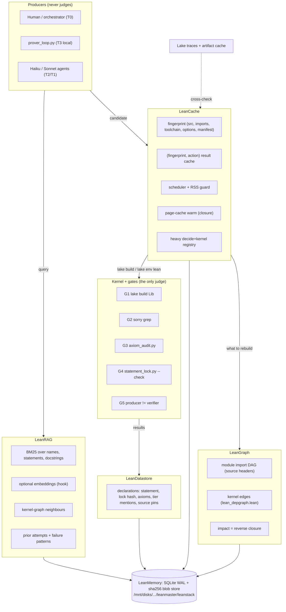

# LeanMaster at scale: LeanMemory, LeanCache, LeanDatastore, LeanGraph, LeanRAG

**Status 2026-09-19.** Counts are a snapshot taken during this session (another session was adding files,
e.g. `DualScaleDyons/FormAutomorphs.lean` appeared afterwards); re-run `python3 -m leanstack ingest --all` and
`stats` for live numbers. This is a design document plus a first implementation (`leanstack/`, unit-tested,
**never yet run against a real Lean build**: the main session was running memory-heavy kernel checks, so
nothing here called `lake`). Every number below is either *measured* (and says how) or *projected* (and
says from what). It supersedes `LEAN_CACHE_OPTIMIZATION.md` (see §11); that file is left unedited as a record.

Status tags used throughout:

| Tag | Meaning |
|---|---|
| **Existing** | code that was already in the repo, read and (where cheap) run on 2026-09-19 |
| **New** | written for this document in `leanstack/`, covered by `tests/test_leanstack.py` (29 tests, no Lean) |
| **Proposed** | design only; no code yet |
| **Mock** | existing code that returns hard-coded results (LL.md Lesson 0.5) |

---

## 0. Summary

* Lake already is a content-addressed per-module cache: each `.lake/build/lib/lean/**/*.trace` (schema
  `2025-09-10`) keys the module on source hash, import hashes, toolchain (`Lean 4.33.1, commit 819816b…`)
  and options (`-DmaxHeartbeats=1000000`, `-DmaxRecDepth=8000`). **LeanCache does not rebuild that.** It adds
  what Lake lacks: a pre-build fingerprint for planning and impact analysis, a result cache for the actions
  Lake never caches (single-file `lake env lean` checks, axiom audits, lock checks), a memory-aware
  scheduler with a kill-before-OOM guard, page-cache warming, and a registry of heavy `decide +kernel` proofs.
* **LeanMemory** is one SQLite (WAL) database plus a content-addressed blob store on the data disk. Every
  layer reads and writes it; it holds modules, declarations, kernel edges, build runs, cached results,
  prover attempts, failure patterns, lessons, the heavy-proof registry, Lake traces and an event log.
* **LeanDatastore / LeanGraph / LeanRAG** are thin layers over LeanMemory that ingest what the existing,
  working gate tools already produce (`statement_lock.json`, `axiom_audit.py` output, `depgraph.jsonl`,
  `prover_attempts.jsonl`) — they do not replace those tools.
* The kernel stays the only judge. Nothing in LeanMemory is evidence that a theorem is proved; a row can say
  "Tier A" only when the statement is locked and unchanged and the saved axiom audit said OK.
* Measured facts that change the design (§2): the import closure of `DualScaleDyons` has 2.2 GB of public
  `.olean` files and **7.0 GB** including `.olean.server` + `.olean.private` (sizes measured); that Lean loads
  the private parts for our non-module files is inferred from 87 % page-cache residency, not proven;
  **swap is off** (INFRA_SETUP.md says a 24 GB swapfile is active); Lake 4.33.1 has **no `--jobs` flag and no
  build lock**.

---

## 1. Inventory of what exists (audited 2026-09-19)

"Ran" means I executed it on 2026-09-19; "read" means I read the code but did not run it (anything that calls
`lake` was not run, per the no-compile constraint).

| Component | What it actually does | Works? | Produces / where | Verdict |
|---|---|---|---|---|
| Lake (toolchain v4.33.1) | per-module traces: `depHash` over source, imports, toolchain, options; `--no-build`, `--rehash`, artifact cache (`LAKE_ARTIFACT_CACHE`, `LAKE_CACHE_DIR`) | read traces + Lake sources | `.lake/build/lib/lean/**/*.trace` (→ data disk via symlink) | **Existing**, the real build cache. `LAKE_ARTIFACT_CACHE`/`LAKE_CACHE_DIR` unset, `~/.cache/lake` absent. No `--jobs` flag (`Lake/CLI/Main.lean`); the only lock file is the lakefile-olean lock (`Lake/Load/Lean/Elab.lean`), so two concurrent `lake build`s on overlapping stale targets could race (inferred from the absence of a build lock; not tested) |
| `leangraph/` (extractor, algorithms, exporters, cli) | regex extraction of declarations and "edges" = tokens of the signature/body that match a known name; PageRank, transitive reduction, exports | ran `python3 -m leangraph.cli --target DualScaleDyons --out <scratch>`: OK, < 1 s | `graph/leangraph.{json,ndjson,dot,gexf}`, `graph/index.html` (committed copy dated 2026-09-17, 867 nodes / 1603 edges) | **Existing, partial.** Edges are text matches, not kernel references (the theorem-search skill itself says prefer `depgraph.jsonl`). "Unused imports" is unusable: it flagged 23 imports in DualScaleDyons, including every `import Mathlib` |
| `leangraph/cache.py` `LeanCacheManager` | SQLite `declarations` table + per-file sha256 in `file_hashes.json`; search = SQL `LIKE` | read; the DB it wrote opens | `.leancache/declarations.db` | **Existing.** Docstring's "<100 ms incremental indexing over massive repositories" was never measured |
| `leangraph/base_graph.py` | indexes ~27 hand-picked "landmark" files; `PAPERS_METADATA` with placeholder citations (`"arxiv": "2501.xxxxx"`, "Meta AI Research Preprint", "Anthropic Technical Monograph") | read | `graph/base_graph/` | **Mock metadata** — do not cite anything from it |
| `leangraph/Lean/DependencyExtractor.lean` | BFS over `getUsedConstants`, JSON dump | read | nothing: no `run_cmd`/`#eval` entry point, no lakefile target, referenced nowhere | **Dead code** |
| `tools/lean_depgraph.lean` | kernel-level dump: per constant, the constants its type and value use | read (needs `lake env lean`) | `.leancache/depgraph.jsonl`: 2374 declarations, 42 575 type/value edges, dated 2026-09-17 | **Existing, stale**: imports 7 libraries; `DualScaleCosmology`, `DualScaleMoonshine`, `DualScaleDyons` (Streams 3–5) are absent |
| `tools/index_declarations.py` | full walk of 7 libraries into `LeanCacheManager` | read; re-ran its extractor in-process: 914 declarations | `.leancache/declarations.db`: 900 rows, 2026-09-17 | **Existing, stale**: misses the same 3 libraries (~600 declarations); head regex misses attribute-prefixed, `private`, `abbrev`, `instance`, `inductive`, `class` heads (21 in the covered libraries) |
| `tools/theorem_atlas.py` | hubs, bridges, TF-IDF similarity, dependency Jaccard | read (would overwrite `papers/book/generated/`) | `papers/book/generated/{lean_catalogue,atlas}.md`, `atlas_data.json`, `.tex` | **Existing**, 7-library scope; all-pairs loop is O(n²) in theorems (§10) |
| `tools/axiom_audit.py` | gate G3: one probe file with `#print axioms` per theorem, `lake env lean` | read | stdout only (nothing saved) | **Existing, real.** Its head regex `^(theorem\|lemma)` skips attribute-prefixed theorems: **2 theorems are never audited** (`DualScaleStream2.Lattice.Signature.add_pos`, `add_neg`, both `@[simp]`) |
| `tools/statement_lock.py` | gate G4: hash of statement text (theorems) / whole body (defs) | ran `--check DualScaleDyons/*.lean`: `statement lock: OK` | `docs/statement_lock.json` (1035 locked declarations) | **Existing, real.** Independent cross-check: `leanstack.source` reproduces **1035/1035** lock hashes. Same head-regex gap: the 2 `@[simp]` theorems and 5 `inductive` types are not lockable; keys are short names per file (two equal short names in different namespaces of one file would collide) |
| `tools/prover_loop.py` | T3 local prover: splice candidate, compile with the lakefile `-D` flags, accept only kernel-clean | read | `.leancache/prover_attempts.jsonl` (173 attempts) | **Existing, real** |
| `tools/lean_cache_manager.py` | `status`/`verify`/`clean`/`reindex`/`optimize`/`benchmark`/`bundle` | read (status walks all of `.lake`; verify/benchmark run `lake build`) | `.leancache/cache_manifest.json` (not present now) | **Mostly cosmetic.** `optimize` hashes files and prints "Zero-redundancy rebuild cache: ACTIVE", but nothing reads the manifest. `benchmark` runs `lake build` twice and prints their ratio as "Prove2Me Decoupled Gain" |
| `LEAN_CACHE_OPTIMIZATION.md` | 4-tier design: signature/proof decoupling, `.leancache/objects/{sha}.olean` AST store, SQLite, cloud bundle | read | — | **Aspirational.** Tiers 1, 2 and 4 have no code (`.leancache/objects/` does not exist). Its benchmark table ("Monolithic Full Build (Cold)… 51 jobs… ~1.42 s") cannot describe a cold build of a project whose builds are 3797 jobs; it links to `/home/xavkal/…`, which does not exist on this VM |
| `.leancache/` | outputs of the tools above + a leftover `tmpnh4mo0ms.lean` | read | 2.2 MB | stale since 2026-09-17/18 |
| `graph/` | regex-graph exports, `LEAN5_GRAPH_ANALYSIS.md` | read | 3.6 MB | stale since 2026-09-17 |
| `foundation_retrieval_map.json` | phase-0 file (2026-09-13): "125 790 files", "100 % weighted coverage" of vendored submodules | read | — | **Not produced by any current tool**; LL.md's header flags these numbers as an overclaim |
| `prove2me_engine/` | card DAG manifest, frontier, prompt formatting, per-card compile via `LEAN_PATH` | read (partially) | `dag_manifest.json`, own lakefile (`Specs`, `Proofs`; 2 proof files) | **Existing, not audited in depth here** |
| `leanautoresearch/` | `evaluator.py` runs `lake build` + a sorry regex (real); `prover.py` is a static list of "PROVEN" experiments; `engine.sync_epistemic_claims` injects hard-coded claims | read | `results.tsv`, `ledger.jsonl` | `evaluator` **Existing**; `prover`, `sync_epistemic_claims` **Mock** (LL.md 0.5, re-confirmed) |
| Skills `leanmaster-theorem-search`, `lean-proof-gate`, `lean-tiered-proving` | wrap the tools above | read | — | **Existing**; theorem-search inherits the 7-library scope of its tools |
| Infrastructure | 29 GB RAM, **0 swap** (`free -g`), 15 GB `/dev/shm`, root 146 GB (89 GB free), data disk 492 GB (326 GB free) | ran `free`, `df` | — | `docs/INFRA_SETUP.md` says a 24 GB swapfile is active; it is not now |

---

## 2. Measured baseline

All measured on 2026-09-19 with read-only commands.

| Quantity | Value | How |
|---|---|---|
| First-party modules / lines | 149 modules, 18 016 lines, 10 `lean_lib`s | `leanstack ingest --sources` (walks `lean_lib` roots through imports) |
| Named declarations | 1528 (686 theorems) | `leanstack.source.declarations`; cross-checked with a comment-blind grep of declaration heads: 1536, the 8 extra are anonymous `instance :` (no source name) |
| Locked statements reproduced | 1035 / 1035 | `tests/test_leanstack.py::test_statement_hash_matches_statement_lock` |
| Kernel edges on file | 42 575 (2374 declarations, 7 libraries) | `leanstack ingest --depgraph` |
| `decide +kernel` sites | 73 declarations in 18 modules | `heavy_decls` table (comment-aware scan) |
| Mathlib package build dir | 8322 modules; `.olean` 1.83 GB, `.olean.private` 3.57 GB, `.olean.server` 0.10 GB (5.7 GB with `.ilean`, hashes, traces) | `find … -printf %s` |
| Toolchain `lib/lean` | 2.7 GB | `du` |

**Import-closure working set** — the `.olean` files a module actually loads, computed by
`python -m leanstack warm --closure <Lib> --dry-run` from source headers (no Lean):

| Library root | Modules in closure | `.olean` only | with `.server` + `.private` |
|---|---|---|---|
| `StringTheoryFoundation` | 17 | 0.003 GB | 0.003 GB |
| `DualScaleCosmology` | 3587 | 0.79 GB | 2.62 GB |
| `DualScaleMoonshine` | 4366 | 1.01 GB | 3.23 GB |
| `DualScaleStream2` | 5031 | 1.20 GB | 3.78 GB |
| `StringTheoryFormalization` | 5602 | 1.15 GB | 3.97 GB |
| `DualScaleDyons` | 10 431 | 2.19 GB | **6.98 GB** |

Our files are not `module` files. At the time of measurement the `.olean.private` files of the
`DualScaleDyons` closure were 87 % page-cache resident (`fincore`), after the main session's compiles —
evidence (not proof) that non-module importers load the private parts too. **Consequence:** a heavy kernel
check in `DualScaleDyons` competes with ~7 GB of olean page cache. On a 29 GB VM with no swap, an anonymous
peak above roughly 29 − 7 − 2 (OS and agent processes) ≈ 20 GB must evict oleans — failure (b) — before
it reaches the OOM killer — failure (a).

**Measured by the main session on 2026-09-19** (LL.md §S8.1–S8.3), not by leanstack:
- peak RSS of single theorems, by `/usr/bin/time -f %M` or polling `/proc/<pid>/status`:
  - `so40_point`: 28 GB with full reconstruction; 11 GB after rewriting with sparse certificates;
  - `so44_point`: 14 GB;
  - `Nodup` on 760 integer lists: > 14 GB (killed);
  - light theorems: 6.5–7.6 GB, almost all of it the Mathlib import.
- the first version of `K3Enhancement.lean` compiled in 5.5 min, then was OOM-killed after a docstring-only edit.
- after each OOM kill, cold-cache olean reads ran at 2–6 MB/s (vmstat `bi`) at ~1 % CPU with `wa` ≈ 12 %. Mathlib
  imports took 20–40 min, and a single-theorem file timed out at 900 s still loading imports.
- the kernel logged 3 `oom_kill` events in the user slice (`memory.events`).

**Not measured**: per-module RSS of a whole-library build under the scheduler, and wall times of whole builds.

**First real guarded run (2026-09-19, `python -m leanstack plan … --check --force`, 19 modules, sequential).**
14 OK, 1 killed by the guard, 4 skipped as its dependents. Recorded peak RSS / anonymous memory:

| Module | Peak RSS | Anon | Wall |
|---|---|---|---|
| `DualScaleDyons.KummerD4` | 7.6 GB | 0.8 GB | 43 s |
| `DualScaleDyons.K3Enhancement` | 8.4 GB | 1.6 GB | 113 s |
| `DualScaleDyons.K3EnhancementSO40` | 11.9 GB | 5.1 GB | 256 s |
| `DualScaleDyons.K3EnhancementSO44` | 14.5 GB | 7.7 GB | 353 s |
| `DualScaleMoonshine.Shadow` | 8.9 GB | 5.1 GB | 431 s |
| light Mathlib-importing modules | 4.0–4.3 GB | 0.3–0.6 GB | 26–69 s |
| `DualScaleMoonshine.HMNBridge` | **19.0 GB, killed** | 19.0 GB | 815 s |

HMNBridge was killed by the `MemAvailable < 2 GB` floor (another process was installing packages at the time),
**before** the kernel OOM killer fired, which is the intended behaviour. It builds with `lake build` when the
machine is otherwise idle. The planner's default of 16 GB for "heavy, never measured" was too low for it; the
recorded peak now raises its estimate. RSS includes ~4 GB of mapped `.olean` pages; the anonymous column is the
memory the kernel actually allocates. The `--check` run printed "build" in its plan header but recorded
`action = check` (cosmetic).


leanstack's own costs (this repo, warm page cache): full source ingest 2.1 s, incremental no-op ingest 0.4 s,
`plan --dry-run` over 149 modules 0.6 s, a search 1.1 s, `ingest --all` 4.1 s (sources already ingested).

---

## 3. Architecture



`leanstack/` modules and their layer:

| File | Layer | Status |
|---|---|---|
| `leanstack/source.py` | shared parsing: imports, `lean_lib` roots, lakefile `-D` options, declarations, `decide +kernel` sites, pins | **New** |
| `leanstack/memory.py` | LeanMemory | **New** |
| `leanstack/cache.py` | LeanCache (fingerprints, result cache, Lake trace reader) + LeanGraph impact | **New** |
| `leanstack/scheduler.py` | LeanCache scheduler + RSS guard | **New** (guard tested on Python children; never on Lean) |
| `leanstack/warm.py` | LeanCache page-cache warming | **New** |
| `leanstack/datastore.py` | LeanDatastore | **New** |
| `leanstack/rag.py` | LeanRAG | **New** |
| `leanstack/cli.py` | `python -m leanstack {plan,fingerprint,impact,ingest,search,warm,stats}` | **New** |

---

## 4. LeanMemory (the common layer) — New

One store, so that the build scheduler, the datastore, the graph and retrieval agree on what a module or a
declaration *is*, and so that agents share experience instead of re-learning it.

* **Location**: `$LEANSTACK_HOME`, default `/mnt/disks/disk-socrateai-local-1/leanmaster/leanstack/`
  (LL.md 0.8: never the root disk). Tests use a temporary directory.
* **`memory.db`** — SQLite in WAL mode (`synchronous=NORMAL`, 30 s busy timeout): many readers and one writer
  at a time, which is what several agents plus one scheduler need. Tables: `modules`, `declarations`,
  `edges`, `build_runs`, `results`, `attempts`, `failures`, `lessons`, `heavy_decls`, `lake_traces`,
  `events` (schema at the top of `leanstack/memory.py`).
* **`blobs/ab/cdef…`** — content-addressed by sha256, written atomically (temp file + `rename`), verified on
  read (a tampered blob raises). Holds build logs, prover proofs, anything large. Identical logs are stored once.
* **Episodic memory.** `attempts` (every prover attempt: theorem, model, accepted, proof blob, first error)
  and `failures` (normalized pattern — positions and numbers stripped — with a counter) are what an agent
  reads before attacking a goal: "this theorem: 6 attempts, 0 accepted, pattern `unsolved goals N` × 4".
  `Retriever.prior_attempts(name)` returns exactly that. Ingesting the existing 173 attempts produced 86
  distinct failure patterns.
* **`lessons`** is the machine-readable twin of LL.md (key → text → source). LL.md stays the human record;
  nothing here edits it. *Proposed*: a lint that fails when a lesson slug referenced in a prompt is missing.
* **`events`** is append-only (who/what/when): ingests, runs, audits, removals of declarations. It is the
  audit trail for "when did this statement change".

---

## 5. LeanCache

### 5.1 What Lake already caches — Existing
A real trace (`DualScaleDyons/AttractorCharges.trace`) lists: the source file hash, each import's
transitive hash, `Lean 4.33.1, commit 819816b…`, the options `-DmaxRecDepth=8000` and
`-DmaxHeartbeats=1000000`, and a combined `depHash`; outputs are stored under content hashes
(`"o": ["9ac562d46d421985.olean"]`). So "content-addressed per-module result cache keyed on (source hash,
transitive import hashes, toolchain, options)" is *already* how `lake build` decides what to recompile.
Duplicating it would be the aspirational-tooling pattern of LL.md 0.5.

### 5.2 What LeanCache adds — New
1. **A fingerprint available before building** (`cache.Fingerprinter`, `leanstack-fp-v1`): sha256 over the
   toolchain string, the sorted lakefile `-D` options, the source sha256, and for each import either
   `own:<module>:<its fingerprint>` or `ext:<module>:<sha256 of lake-manifest package pins>`. Mathlib bumps
   change exactly the fingerprints that import Mathlib (tested). Iterative, so no recursion limit; raises on
   import cycles. The planner and impact analysis use it without invoking Lake.
2. **A result cache for what Lake never caches**, keyed `(fingerprint, action)`, actions `build`, `check`
   (single-file `lake env lean`, what prover_loop and agents run hundreds of times), `audit`, `lock`.
   `fingerprint_text(candidate)` keys a prover candidate that is not yet a module: the same candidate against
   the same imports is never compiled twice, and a known failure is returned from memory.
3. **Cross-check against Lake**: `python -m leanstack fingerprint M --trace` prints our fingerprint next to
   Lake's `depHash`. They use different hash functions and are never equal; what must agree is *when they
   change*. Unknown trace schemas are skipped, not guessed (`KNOWN_TRACE_SCHEMAS = {"2025-09-10"}`).
   *Proposed:* seed the result cache on first use with `lake build --no-build <Module>` (exit code says
   whether the module is up to date) instead of 149 real `lake build` calls.

### 5.3 The four observed failures and the countermeasures

| Failure | Countermeasure | Status |
|---|---|---|
| (a) one `decide +kernel` theorem at 11–28 GB, OOM-killed; kernel memory accumulates across a file's `decide +kernel` calls | **Heavy registry** (`heavy_decls`: every declaration whose proof calls `decide +kernel`, comment-aware; 73 today). Planner treats a module with `decide +kernel` and no history as heavy (16 GB estimate) and runs it **alone**. Policy: at most one heavy `decide +kernel` theorem per file (as done by hand with `K3EnhancementSO40/SO44.lean`); *Proposed:* a lint that fails when a file has two declarations whose recorded peak exceeds a threshold | registry + alone-scheduling **New**; lint **Proposed** |
| (a′) the process dies at the global OOM killer, losing its peak | **RSS guard** (`scheduler.run_guarded`): own process group (`start_new_session`), polls `/proc` for *every* process in the group every 0.5 s — `lake` spawns `lean` as a child, and on this VM a running `lake env lean` showed ~0.8 GB RSS for `lake` and ~0.8 GB for its `lean` child (`ps`), so polling only the lake pid misses the consumer. Kills the group (`SIGTERM`, then `SIGKILL`, via `os.killpg`, never `pkill -f`) at the per-module budget or when system `MemAvailable` drops below a floor (default 2 GB). The peak is recorded even for killed runs, so the next estimate is ≥ peak × 1.25: the budget learns upward | **New**, tested with Python children (300 MB allocation killed at 100 MB; allocation in a grandchild killed through the group sum) |
| (b) each OOM kill flushed the page cache → 20–40 min of olean re-reads at ~2 MB/s | (1) kill **before** the kernel reclaims the page cache: the guard's `MemAvailable` floor plus a global budget of `MemTotal − reserve` (default reserve 8 GB ≈ the 7 GB Dyons closure + OS); (2) **warm exactly the closure**: `python -m leanstack warm --closure DualScaleDyons` reads 6.98 GB sequentially in 8 MB chunks with `POSIX_FADV_SEQUENTIAL` (vs. mmap page faults), `--resident` reports residency via `fincore` before/after; `--max-gb` caps it; nothing is warmed without an explicit target. **Run before a session, never during a build** | **New**; warming tested only on a 2.4 MB directory (15.7 MB/s on 10 files — not a disk benchmark) |
| (c) parallel compiles multiplied memory | Lake 4.33.1 has no `--jobs`; `lake build <Lib>` runs its Lean jobs in parallel. The scheduler calls `lake build <Module>` **one module at a time in topological order**, so each call compiles exactly one file (its imports are already built). Extra parallelism only for light modules and only while the sum of estimates fits the budget (`--parallel N`, default 1). Because Lake 4.33.1 has no build lock, the scheduler never starts a module before all its first-party imports finished OK — given that (untested) race inference, two concurrent `lake build`s then never need the same stale module | **New** (tested with a fake runner: heavy module always ran alone; dependents of a failure skipped) |
| (d) `lake env lean` ignores lakefile options | `source.lake_lean_options()` reads `leanOptions` from `lakefile.lean` (`-DmaxHeartbeats=1000000 -DmaxRecDepth=8000` here) and the `check` action always passes them; the options are also part of the fingerprint | **New** |

### 5.4 Page cache vs. tmpfs vs. local SSD
* **tmpfs for oleans is self-defeating on this VM.** tmpfs pages are not reclaimable without swap, and swap
  is off: pinning the 7 GB Dyons closure would take 7 GB permanently away from a kernel check that needs
  11–28 GB. The page cache is the same RAM but the kernel can reclaim it; warming it is the right tool here.
* tmpfs becomes right on a machine with RAM ≥ closure + largest heavy check + margin (here ≥ ~40 GB), or for
  the small Mathlib-free libraries (their closure is < 3 MB).
* A **local NVMe SSD** (GCP "local SSD", *Proposed*) holding `.lake/packages/*/.lake/build` removes the
  2–6 MB/s persistent-disk bottleneck regardless of the page cache; it is ephemeral, so it must be re-filled
  from `lake exe cache get` / the Lake artifact cache after a VM restart.
* **Swap** (*owner decision*): re-enabling the documented 24 GB swapfile on the data disk would turn some OOM
  kills into slow runs. The guard's `MemAvailable` floor still applies; swapping a kernel check at 2–6 MB/s
  may be slower than a kill and retry — measure before deciding.
* **`LAKE_CACHE_DIR`** (*Proposed*): if the Lake artifact cache is enabled (`LAKE_ARTIFACT_CACHE=true`), set
  `LAKE_CACHE_DIR=/mnt/disks/disk-socrateai-local-1/leanmaster/lake-cache` first, or it defaults under
  `$HOME` (root disk).

### 5.5 Incremental re-verification — New (planner) / Proposed (audit)
* Changed modules = modules whose fingerprint differs from the last `ok` result. Affected modules =
  `cache.impacted(changed)`, the reverse import closure (`python -m leanstack impact DualScaleDyons.KummerD4`
  lists 6 modules). Only those are rebuilt.
* Axiom sets propagate through dependencies, so the audit must re-run for the **impacted** set, not only the
  edited file. *Proposed:* run `axiom_audit.py` per impacted module (it already accepts `.lean` files) and
  store results under `(fingerprint, "audit")`; a declaration whose module fingerprint is unchanged keeps its
  audit. The statement lock needs no Lean and is re-checked for every changed file.
* Declarations whose statement hash changes have their stored audit **cleared** at ingest (tested), so a
  stale OK can never make a changed statement look Tier A.

---

## 6. LeanDatastore — New (ingest) over Existing tools

The canonical record per declaration (`declarations` table, key `(file, short name)` — the statement-lock
key — plus the namespace-qualified `name` — the axiom-audit key):

| Field | Source |
|---|---|
| `statement`, `statement_hash` | source text, via `statement_lock.statement_text` (hash identical to the lock's: 1035/1035) |
| `lock_hash` | `docs/statement_lock.json` (read-only here) |
| `axioms`, `audit_status` | saved stdout of `tools/axiom_audit.py` (`ingest --audit FILE`); the verdict is re-derived from the axiom list as a cross-check (`disagree` count) |
| `tiers` | "Tier A/L/C" mentions in the docstring — stored as mentions, never assigned by code |
| `pins` | `papers/foundations/<file>.txt` + `l. N` / `ll. N–M` parsed from the docstring |
| `line`, `kind`, `docstring`, `module` | source |

`datastore.kernel_status(row)` returns `"A"` only for a theorem that is locked, unchanged since the lock,
and audited OK; otherwise the reason (`unlocked`, `statement changed since lock`, `audit not run`,
`audit FAIL`). That is a statement about the Lean statement only; the physics tier (L/C) stays human-assigned
(CLAUDE.md tier rules).

*Proposed next:* `tools/axiom_audit.py` writes its stdout to the blob store and the datastore ingests it
automatically inside `tools/gate.sh` (LL.md S2-I item 4), and paper claim tables are generated from the
datastore (LL.md S2-I item 6). Fixing the two gaps found in §1 (attribute-prefixed theorems not audited or
locked; `inductive` not lockable) belongs in those tools, not here — `leanstack.source.DECL_HEAD` shows the
regex shape that covers them.

---

## 7. LeanGraph

* **Module graph — New.** From source headers (`source.imports`, handles `module`/`public import`/`import all`);
  topological order and reverse closure in `scheduler.topo_order` / `cache.impacted`.
* **Declaration graph — Existing tool, New ingest.** `tools/lean_depgraph.lean` gives real kernel references
  (type vs value). `ingest --depgraph` loads them into `edges` (42 575 today). The tool must be extended to
  the 10 libraries (3 missing) and, at scale, run **per module** (one `run_cmd` per module importing only that
  module), so it never imports the whole project into one process — *Proposed*.
* **The regex graph (`leangraph/`)** stays for visual exports; it is not used for decisions.
* **Partitioning at scale — Proposed.** Rules, in order: (1) one `lean_lib` per stream, as today; (2) heavy
  `decide +kernel` files in a separate, non-default `lean_lib` (e.g. `DualScaleDyonsHeavy`) so a default
  `lake build` never schedules two of them; (3) split a library when its import closure's working set
  (§2 table) approaches the memory reserve, or when one module has > ~50 dependents (it is a rebuild hub);
  (4) keep Mathlib-free cores Mathlib-free (their closure is 3 MB, they build anywhere).

---

## 8. LeanRAG — New

`rag.Retriever(memory, embed=None)`:
* **Lexical**: BM25 (k1 = 1.2, b = 0.75) over `name name statement docstring`, identifiers split on `.`, `_`
  and camelCase (`thetaShift_isODD` → theta, shift, is, odd).
* **Dense**: any `embed(texts) -> vectors` callable (e.g. a local Ollama embedding model on the data disk);
  fused with BM25 by reciprocal-rank fusion. None is bundled.
* **Graph**: each hit's kernel neighbours (from `edges`) appended with the relation (`dependency of X`,
  `depends on X`) — finds the lemma a theorem actually rests on, and near-duplicates.
* Every hit shows file:line, statement, and `kernel_status`, because retrieval finds what exists; whether it
  is proved is always the gate's answer.

Example (real store): `python -m leanstack search "K3 Euler characteristic 24"` returns
`DoubleFieldTheory.K3Topology.k3_euler_characteristic`, `Lean5Corpus…k3_euler_characteristic_identity`,
`SocrateAI.Moonshine.k3_euler_eq_24` — the "same fact proved in several libraries" that the theorem-search
skill lists as unification candidates.

Scale: the pure-Python index is fine to ~10⁴ declarations. *Proposed* for 10⁵+: SQLite FTS5 on the same
table (`bm25()` ranking, incremental), embeddings in a flat file of float16 vectors per library (85 k × 768 ×
2 B ≈ 130 MB at 10⁶ lines — arithmetic, §10), approximate neighbours only if exact search gets slow.

---

## 9. End-to-end: generating and maintaining code at scale

```
1. T0 designs statements (sorry bodies)  -> statement_lock --update after review        [Existing]
2. Agent asks LeanRAG: similar theorems, their deps, prior attempts + failure patterns   [New]
3. Agent proposes a candidate proof      -> fingerprint_text(candidate)
       cached? return the stored result (never compile the same text twice)             [New]
4. Candidate check: `lake env lean` + lakefile -D options, under the RSS guard,
   heavy ones alone; result + peak memory + log -> LeanMemory                           [New, not yet wired into prover_loop]
5. Accepted -> spliced into the module   -> planner: changed + impacted modules only
       -> `lake build <Module>` one at a time in topological order                       [New]
6. Gates, run by the orchestrator (producer != verifier):
       G1 lake build <Lib>, G2 sorry grep, G3 axiom_audit (impacted modules),
       G4 statement_lock --check, G5 recompile agent output yourself                     [Existing tools]
7. LeanDatastore ingests lock + audit    -> kernel_status "A" only if all hold           [New]
8. Failures -> failure patterns; lessons -> LL.md (human) + lessons table                [New / Existing]
```
The kernel is the only judge at steps 4–6; LeanMemory only remembers verdicts and never produces one.

---

## 10. Scaling: what breaks at 10⁵, 10⁶, 10⁷ lines

Projections are arithmetic on today's measured ratios: 1528 named declarations and 686 theorems per 18 016
lines (≈ 85 declarations and 38 theorems per 1000 lines), 2374 kernel constants per ~13 k lines of the 7
depgraph libraries. They are not measurements.

| | 10⁵ lines | 10⁶ lines | 10⁷ lines |
|---|---|---|---|
| declarations (projected) | ~8.5 k | ~85 k | ~850 k |
| theorems (projected) | ~3.8 k | ~38 k | ~380 k |
| `statement_lock.json` single file | fine | merge conflicts between agents → shard per `lean_lib` | must be a table (LeanMemory), JSON export only |
| `axiom_audit.py` (one probe importing a whole library) | fine | one process importing a 10⁵-line library: memory like a heavy build → per-module audit, impacted set only (§5.5) | same, distributed |
| `lean_depgraph.lean` (imports everything) | fine | → per-module runs | → per-module, in CI |
| `theorem_atlas.py` all-pairs similarity | 7 M pairs, minutes | 7·10⁸ pairs: impractical → candidate blocking (shared rare tokens / shared deps) before pairwise | → ANN index |
| LeanRAG pure-Python BM25 | fine | seconds per query → FTS5 | FTS5 + sharded embeddings |
| LeanMemory SQLite | fine | fine (10⁵ declaration rows; `events` grows fastest → rotate yearly) | fine for declarations; `events`/`attempts` partitioned per stream |
| source ingest (2.1 s full at 18 k lines, linear) | ~12 s | ~2 min full, incremental in seconds | ~20 min full → only incremental |
| full rebuild on one 8-core 29 GB VM | hours at most | not the normal path: incremental + shared artifact cache | impossible; distributed builds from a shared artifact cache |
| Lake | Mathlib (8322 modules here) shows 10⁴ modules work | ~10⁴ own modules: fine | 10⁵ modules: workspace load time becomes visible — split into several Lake packages |

**Sharding.** One `lean_lib` per stream (today); at 10⁶ lines, libraries of ~10⁴–10⁵ lines with an acyclic
library graph; heavy kernel proofs in their own non-default libraries; at 10⁷, several Lake packages pinned
to one Mathlib, each with its own CI.

**CI (*Proposed*).** Standard hosted runners (a few GB of RAM) cannot run the 11–28 GB kernel checks.
Split: (1) CI on hosted runners builds all non-heavy libraries from the Lake artifact cache, runs the
sorry grep, statement-lock check and axiom audit of impacted modules; (2) heavy libraries run on the VM (or a
large runner) under the leanstack guard, and their results are recorded with the fingerprint, so CI can
verify "this fingerprint was checked OK on <date> by <run id>" without re-running the kernel check. That
record is bookkeeping, not proof: a release still re-runs every gate on one machine.

---

## 11. Problems found in the existing tooling

1. **Fixed in v3.27.0** (head regexes now accept `@[…]` prefixes and `inductive`; no existing lock hash changed;
   the two theorems audit OK). Was: `tools/axiom_audit.py` never audits attribute-prefixed theorems (2 today:
   `DualScaleStream2.Lattice.Signature.add_pos`, `add_neg`, both `@[simp]`); `tools/statement_lock.py` cannot
   lock them either, nor `inductive` types (5 today). Consequence: `DualScaleStream2` has 102 theorems by the
   leanstack parser, and the audit's "100 theorems, 0 failing" (VERIFIED_FOUNDATION.md §1) is 100 of 102 —
   the published number is what the tool audited, but its denominator is set by a regex, not by the library.
2. `tools/index_declarations.py`, `tools/lean_depgraph.lean`, `tools/theorem_atlas.py` cover 7 of the 10
   libraries; Streams 3–5 (`DualScaleCosmology`, `DualScaleMoonshine`, `DualScaleDyons`, ~600 declarations)
   are absent from `.leancache/declarations.db`, `depgraph.jsonl` and the atlas. The theorem-search skill
   therefore cannot find them. (LL.md 0.7 again: scope lists silently lag the lakefile.) Reading the scope from
   `lakefile.lean`, as `leanstack.source.lean_libs` does, removes the hand-maintained list.
3. `.leancache/declarations.db` is stale (900 rows vs 914 extractable now in the covered libraries).
4. `leangraph`'s "unused imports" reports every `import Mathlib…` as unused (regex graph); do not act on it.
5. `leangraph/Lean/DependencyExtractor.lean` is never executed (no entry point, no target).
6. `leangraph/base_graph.py` `PAPERS_METADATA` contains placeholder citations (`2501.xxxxx`, …).
7. `tools/lean_cache_manager.py optimize` claims an active "zero-redundancy rebuild cache" that nothing uses;
   `benchmark` labels the ratio of two `lake build` wall times as a "Prove2Me Decoupled Gain".
8. `LEAN_CACHE_OPTIMIZATION.md`: tiers 1, 2, 4 unimplemented; benchmark table not reproducible (51 jobs /
   1.42 s "cold"); links to a non-existent `/home/xavkal/` path. Superseded by this document.
9. `docs/INFRA_SETUP.md` says a 24 GB swapfile is active; `free -g` shows 0 swap.
10. `leanautoresearch/prover.py` and `engine.sync_epistemic_claims` are mocks (already in LL.md 0.5).

None of these were changed here (out of scope, and some files are owned by the main session).

---

## 12. Roadmap

| Step | What | Needs |
|---|---|---|
| 1 | First real run, when no other session compiles: `python -m leanstack warm --closure DualScaleDyons --resident`, then `python -m leanstack plan DualScaleDyons` (sequential, guarded) to record real per-module peaks | a quiet VM |
| 2 | Wire the guard + `fingerprint_text` cache into `tools/prover_loop.py` (one function call around `compile_lean`) | step 1 |
| 3 | `tools/gate.sh` (LL.md S2-I 4): gates + `leanstack ingest --all --audit <saved>` | — |
| 4 | Fix §11 items 1–2 in the gate tools (attribute heads, lakefile-driven scope) | owner review (gate tools) |
| 5 | Heavy-file lint + separate heavy `lean_lib` | step 1 data |
| 6 | FTS5 retrieval, per-module depgraph, CI split | when the corpus passes ~10⁵ lines |
| Owner decisions | swap on/off; local SSD; `LAKE_ARTIFACT_CACHE` + `LAKE_CACHE_DIR` on the data disk | — |

---

## 13. Using leanstack today

```bash
cd ~/SocrateAI-Scientific-Agora-LeanMaster
python3 -m leanstack ingest --all                 # sources, lock, depgraph, prover attempts, Lake traces
python3 tools/axiom_audit.py DualScaleStream2 > /tmp/audit.txt && python3 -m leanstack ingest --audit /tmp/audit.txt
python3 -m leanstack search "generalized metric positive definite" --theorems
python3 -m leanstack impact DualScaleStream2.DFT.GeneralizedMetric
python3 -m leanstack fingerprint DualScaleDyons.KummerD4 --trace
python3 -m leanstack plan DualScaleDyons --dry-run    # the plan only; without --dry-run it BUILDS, guarded
python3 -m leanstack warm --closure DualScaleDyons --dry-run --resident
python3 -m pytest tests/test_leanstack.py -q      # 29 tests, ~6 s, no Lean
```
(`axiom_audit.py` and `plan` without `--dry-run` compile Lean: do not run them while another session is
running heavy kernel checks on this machine.)
