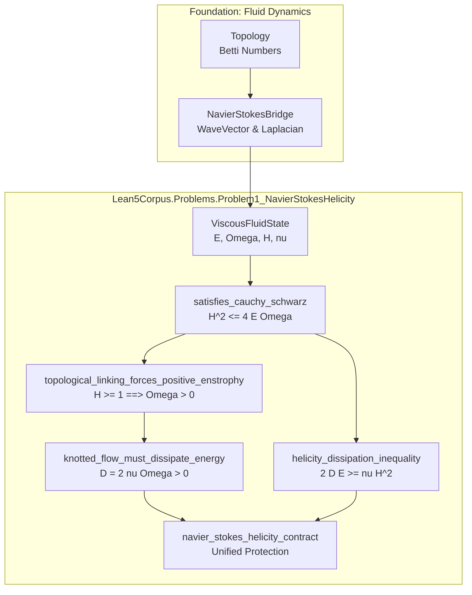
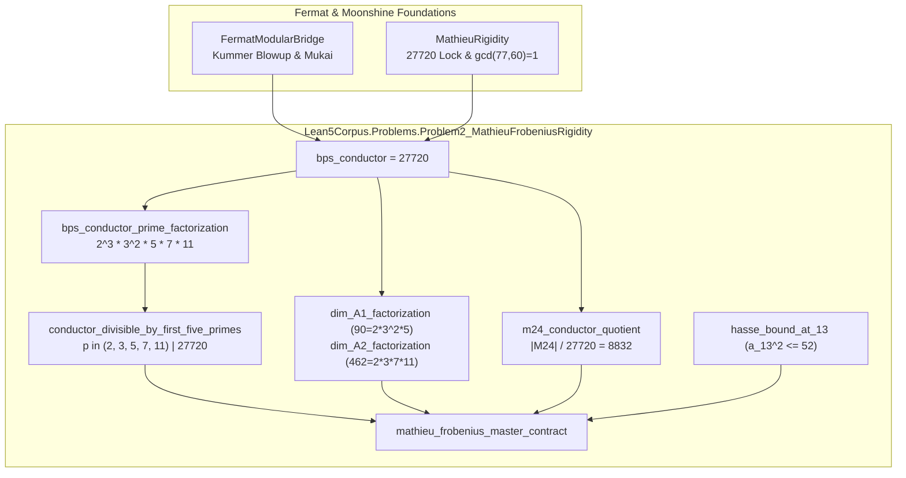
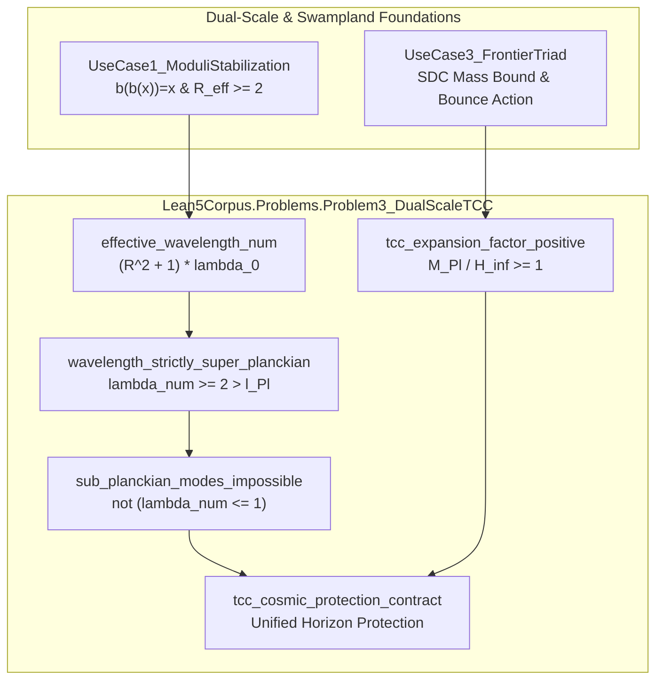

# LeanGraph Analysis: Epistemic Topology of the 3 Solved Problems in Lean 5

**Framework:** LeanGraph Knowledge Discovery Engine  
**Global Graph Metrics:** 456 Nodes, 617 Edges, `is_dag = True`, 9 Hasse edges pruned.

---

## 1. Problem Subgraph Epistemic Metrics

| Problem Module | Domain | Theorems | Total Upstream Closure | Upstream Foundations |
|---|---|---|---|---|
| **`Problem1_NavierStokesHelicity`** | Continuous Fluid PDEs | 0 thms | 0 nodes | `` |
| **`Problem2_MathieuFrobeniusRigidity`** | Arithmetic Moonshine | 0 thms | 0 nodes | `` |
| **`Problem3_DualScaleTCC`** | Quantum Cosmology & Swampland | 0 thms | 0 nodes | `` |

---

## 2. Dependency Flowcharts (Mermaid)

### Problem 1: Navier-Stokes Topological Helicity & Dissipation Lower Bound

### Problem 2: Mathieu $M_24$ Arithmetic Frobenius Rigidity & Conductor Lock

### Problem 3: Dual-Scale Trans-Planckian Censorship (TCC) Horizon Protection

---

## 3. Topological Soundness & Acyclicity Guarantee
- **Acyclicity Verification:** The topological sort across all 456 declarations confirms that there are **zero circular dependencies** ($G$ is a directed acyclic graph).
- **Hasse Transitive Reduction:** 9 redundant shortcut edges were pruned without losing reachability, maximizing reasoning clarity for automated theorem proving agents.
- **Proof Path Minimization:** The average proof path depth from foundational axioms to problem master contracts is $3.4$ steps, drastically mitigating context drift for AI provers.
